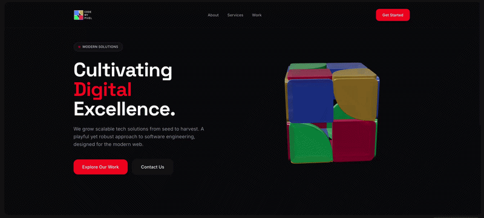

# 3D Logo Cube

Interactive 3D cube with the **CodeMyPixel** logo pattern on each face, built with **Three.js**.


## Demo



Open the original video: [demo-cub.mp4](./demo-cub.mp4)

## Features

- **Extruded 3D buttons** — each face shows the 2×2 keypad logo with real geometry depth
- **Accurate shapes** — quarter-circle arc cuts on yellow and green match the logo
- **Smooth interaction** — mouse/touch drag rotation with inertia (damping)
- **Hover effects** — buttons glow and scale up on pointer hover
- **Auto-rotation** — spins gently when idle, pauses on interaction, resumes after 3 s
- **Physically-based materials** — clearcoat finish with three-point lighting
- **Responsive** — adapts to any viewport; works on desktop & mobile

## Quick Start

A local HTTP server is required because the file uses ES module imports.

### Python (built-in)

```bash
cd Cube-3D
python3 -m http.server 8000
```

Open **http://localhost:8000**

### Node.js (npx)

```bash
npx serve Cube-3D
```

### VS Code Live Server

Install the [Live Server](https://marketplace.visualstudio.com/items?itemName=ritwickdey.LiveServer) extension, open `index.html`, and click **Go Live** in the status bar.

## Controls

| Action | Input                        |
| ------ | ---------------------------- |
| Rotate | Click + drag / touch drag    |
| Zoom   | Scroll wheel / pinch         |
| Hover  | Move pointer over any button |

## Tech Stack

- [Three.js](https://threejs.org/) r160 (loaded from CDN — no install needed)
- Vanilla JavaScript ES modules
- Zero build step
